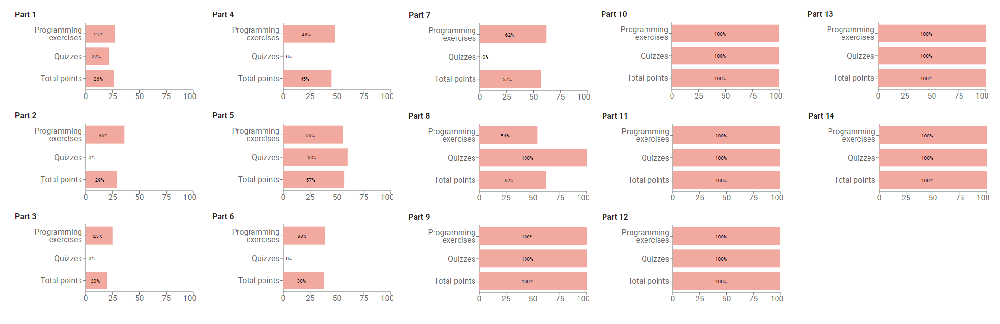

# Java Programming I and II (MOOC.fi)

This repository contains exercises I completed from University of Helsinki's updated online Java Programming course (released 2020, course material available at https://java-programming.mooc.fi/ and https://github.com/rage/java-programming/tree/master/data).

Java Files contains .java files with the code for each exercise, while Project Folders contains exercise folders which can be compiled in NetBeans.

I mainly completed Java Programming II (parts 8-14) because I already had sufficient knowledge of the material convered in parts 1-7. Here is an image of my progress:

